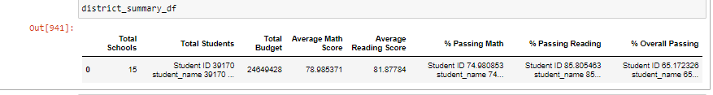
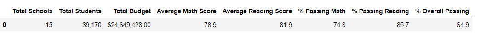
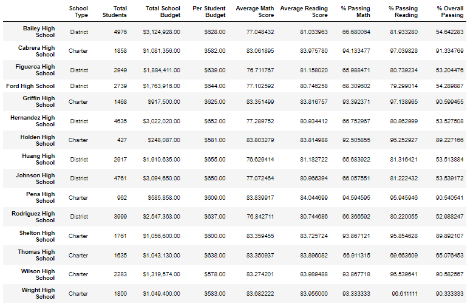
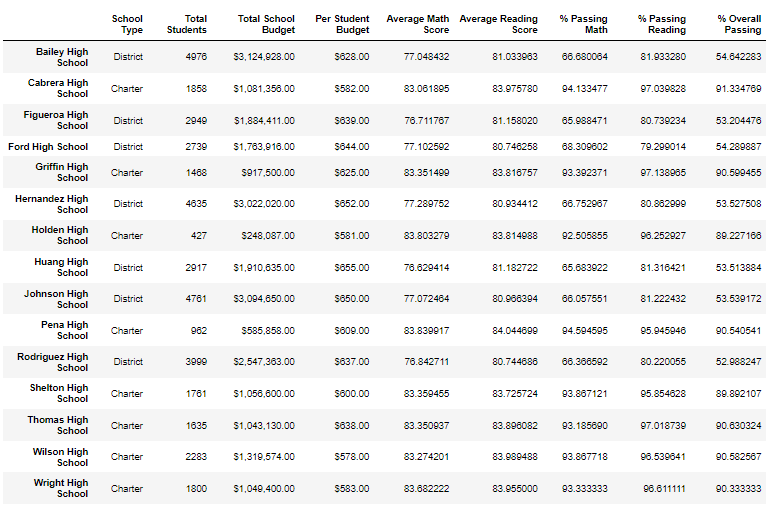
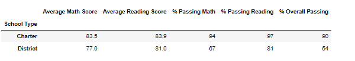

# School_District_Analysis - Challenge Number 4

## Overview of the School District Analysis
    The overview of the School District Analysis was to assist a City School District with reviewing standardized testing data and interpret performance trends by using Pandas.  By using code within Pandas, we can easily showcase specific test score trends whether it be within a school or district in a summary format that is presentable to board members.  The summaries contained within the data help assess the needs of specific schools and can even show a direct correlation between the amount of school funding and the size of the school to a particular school’s test scores.  

## School District Analysis Results: 
***
* Effect on District Summary 

    When comparing the original analysis to the refactored code, it can be noted that there is little difference.  As shown in the images below, The original district summary prior to removal of the ninth-grade students shows an average math score of 78.985317 while the math score with the elimination of the ninth-grade students shows the same average score but it has simply been rounded to the nearest tenth of a percent.  The average reading score is approximately the same as well with once again the percentage being rounded to the nearest tenth.  The passing math score however went down ever so slightly in the refactoring from 74.98% passing to 74.8 %.  The overall passing percentage went down with the refactoring as well from 65.172326% to 64.9%.

      
* Effect on School Summary 

    The effect of the school summary by replacing the grades in the refactored analysis is quite significant compared to the district summary.  As displayed in the image below, the per school summary before replacing the values indicates a much lower percentage passing both in reading and math for Thomas High School.  For example, the % Passing Math is only 66.911315% percent prior to the replacement vs. after the replacement seen in the second image where it is 30% higher at 93.185690 percent.  However, when comparing the other schools, there appears to be no effect at all.  As detailed in the images of the full per_school summaries, the other school's scores and passing percentages remained the same.    

.png)

.png)

* Thomas High School's Ninth Grade Performance Results

    As explained in the analysis of the school summary, by eliminating the ninth grade scores, Thomas High School is able to move up significantly in the ranks of performing schools from being just a few spots away the bottom of the performing schools to becoming the second highest performing school. It appears that the removal of the data gives a huge advantage to Thomas High School in comparison to the other schools, as generally speaking, higher performing schools often get more attention and funding from the district.

.png) 

* Effect of Replacement of Ninth Grade Performace Results 

    * Math and reading scores by grade

    By replacing the ninth grade math and reading scores for Thomas High School with respect to the rest of the schools, it throws the overall average off as there is one less school accounted for.  While the overall % of students passing remains about the same, the revised district summary shows a slight decrease in the percentage of passing math and passing reading.
    
    
    * Scores by school spending
    
    While the data indicates that the same amount of money was spent on each student with and without the ninth grade students, it can be assumed that With a lesser number of students and the same amount of budget, there would be more money allocated to each student to help them succeed.  As such, the scores of a given school, Thomas High School for example is likely to have higher scores based upon the fact that more money can be spent per student in the resources they need like tutoring or technology to increase their testing scores. 

    * Scores by school size
   
    The omission of data appears to have no effect on the size of the schools and their respective scores as the total number of students remains the same.  As previously referenced, if the total number of students for Thomas High School in the amended summaries reflected a different total not taking into account the ommission of the ninth grade student population, it could make the school size move from a medium size school to a large size school as the current total listed is 1,635 students but the ninth grade population is 461 students alone which would make the total 2,096.  

    * Scores by school type
    
    As Thomas High School is classified as Charter School, by amending the scores, it makes it so that the average math and reading scores as well as the % passing math and reading and overall passing are signifcantly higher for charter schools than they are district schools as shown in the image below.  If Thomas High School had not amended the scores, the difference between the charter and district schools when compared by type would have been closer instead of a 30% difference like it is when comparing the passing math percentages. 

***
## School District Analysis Summary:
    Overall, after the replacement of ninth grade scores for Thomas High School, it can be noted that the math and reading scores remain the same but it is the percentages that increase the most as the new percentage is based on a lesser number of students.  The change in the data then causes a chain reaction in other categories such as high and low performing schools and school type.  Thomas High School goes from being one of the mid to lower performing schools to being the second highest performing school.  This then gives an advantage to the charter schools when compared to the district schools by type as it showcases a stark difference between the two.       
