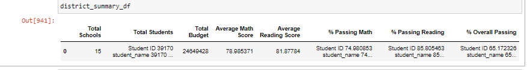
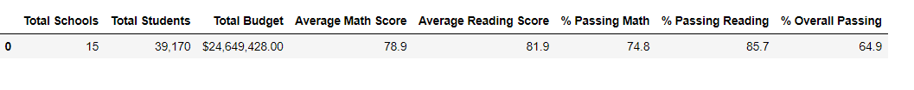

# School_District_Analysis - Challenge Number 4

## Overview of the School District Analysis
    The overview of the School District Analysis was to assist a City School District with reviewing standardized testing data and interpret performance trends by using Pandas.  By using code within Pandas, we can easily showcase specific test score trends whether it be within a school or district in a summary format that is presentable to board members.  The summaries contained within the data help assess the needs of specific schools and can even show a direct correlation between the amount of school funding and the size of the school to a particular school’s test scores.  

## School District Analysis Results: 
***
* Affect on District Summary 
      When comparing the original analysis to the refactored code, it can be noted that there is little difference.  As shown in the images below, The original district summary prior to removal of the ninth-grade students shows an average math score of 78.985317 while the math score with the elimination of the ninth-grade students shows the same average score but it has simply been rounded to the nearest tenth of a percent.  The average reading score is approximately the same as well with once again the percentage being rounded to the nearest tenth.  The passing math score however went down ever so slightly in the refactoring from 74.98% passing to 74.8 %.  The overall passing percentage went down with the refactoring as well from 65.172326% to 64.9%.

      
* Affect on School Summary 
    How is the school summary affected?

* Thomas High School's Ninth Grade Performance Results
    By eliminating the 

* Affect of Replacement of Ninth Grade Performace Results 
    How does replacing the ninth-grade scores affect the following:
    Math and reading scores by grade
    * Scores by school spending

    * Scores by school size

    * Scores by school type

***
## School District Analysis Summary:
Summarize four changes in the updated school district analysis after reading and math scores for the ninth grade at Thomas High School have been replaced with NaNs.

